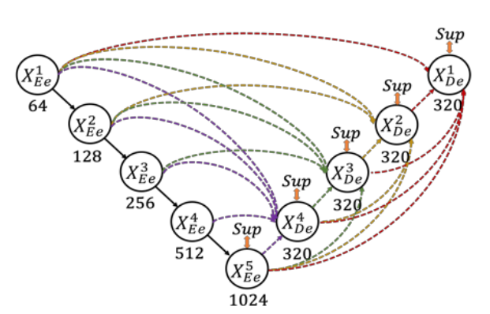
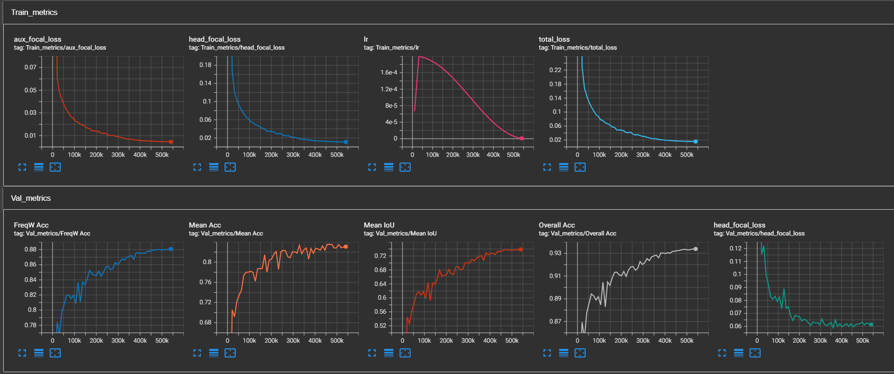

A pytorch implementation of UNetV3Plus.  



UNetV3Plus is originally designed for medical image segmentation, I modify it to use custom encoder such as resnet and support multi-label segmentation, here is the result on Pascal VOC2012:

Training: 512x512 random crop  
validation: 512x512 center crop

|  Model          | Batch Size  |  mIoU        |
| :--------        | :-------------: | :----:   | 
| UNetV3Plus-ResNet34       | 16*4      |   0.739     |

  
Download from [Google Drive](https://drive.google.com/drive/folders/17fRLtYMA2LZdL7QDr7OF76uhN9GIK5uP?usp=sharing)

16*4 means batch size 16 and 4 gradient accumulation steps.  
Run ```python train.py --cfg config/resnet34_voc.yaml``` to reproduce the result.   

Although Multi-label MS-SSIM loss is implemented but not used in the training, modify the 'loss_type' in the config file to 'u3p' to use it.   
The config file of the original model in the official paper is config/original_voc.yaml.   
Please reference config/config.py for more info about model arch or training settings. Custom Dataset is not supported yet.  

Use tensorboard or wandb to log training metrics.  



# Prepare Datasets
## Pascal VOC
Download [VOC2012](http://host.robots.ox.ac.uk/pascal/VOC/voc2012/VOCtrainval_11-May-2012.tar) and [trainaug](https://www.dropbox.com/s/oeu149j8qtbs1x0/SegmentationClassAug.zip?dl=0), 
Extract trainaug labels (SegmentationClassAug) to the VOC2012 directory.  
More info about trainaug can be found in [DeepLabV3Plus](https://github.com/VainF/DeepLabV3Plus-Pytorch/blob/master/README.md).  

```
/data
    /VOCdevkit  
        /VOC2012
            /SegmentationClass
            /SegmentationClassAug  # <= the trainaug labels
                2007_000032.png
                ...
            /JPEGImages
            ...
        ...
    /VOCtrainval_11-May-2012.tar
    ...
```

# Acknowledgement
* [UNet 3+: A Full-Scale Connected UNet for Medical Image Segmentation](https://arxiv.org/abs/2004.08790)
* VOC2012 data-pipeline and eval-metrics are modified from  [DeepLabV3Plus](https://github.com/VainF/DeepLabV3Plus-Pytorch)
